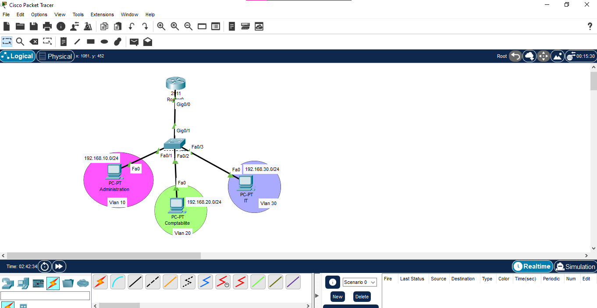
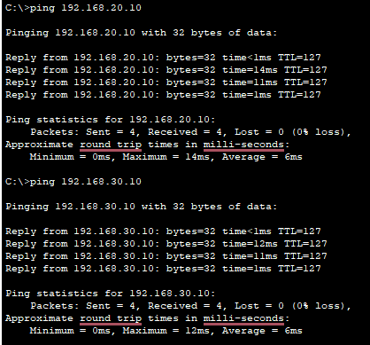
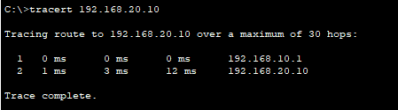

# Projet 1: Réseau d'entreprise (VLANs + Inter-VLAN Routing + DHCP)

## Objectif
Concevoir un réseau d'entreprise segmenté en 3 VLANs avec routage
inter-VLAN (router-on-a-stick) et DHCP centralisé sur le routeur.

## Topologie

## Plan d'adressage
| VLAN | Nom            | Réseau          | Gateway      |
|------|----------------|-----------------|--------------|
| 10   | Administration | 192.168.10.0/24 | 192.168.10.1 |
| 20   | Comptabilite   | 192.168.20.0/24 | 192.168.20.1 |
| 30   | IT             | 192.168.30.0/24 | 192.168.30.1 |

## Technologies
VLAN 802.1Q, Trunk, Router-on-a-stick, DHCP, Cisco Packet Tracer

## Configuration
- SW1: voir `configs/SW1-config.txt`
- R1: voir `configs/R1-config.txt`

## Tests et résultats

### Ping entre VLANs

### Tracert de PC-Admin vers PC-Compta

Le `tracert` de PC-Admin vers PC-Compta passe par R1 (192.168.10.1)
avant d'atteindre 192.168.20.10, ce qui confirme le routage inter-VLAN.

## Problèmes rencontrés
1. **PC en 169.254.x.x (APIPA)**: la config des ports du switch
   n'avait pas été appliquée (prompt en user mode, sans `enable`).
   Résolu en reconfigurant les ports access et le trunk.
2. **Mauvaise plage DHCP exclue**: une faute de frappe dans
   `ip dhcp excluded-address` (plage 192.168.20.1 - 192.168.10.9).
   Corrigée avec `no ip dhcp excluded-address` puis la bonne plage.

## Améliorations possibles
Ajout de port-security, ACL entre VLANs, redondance (HSRP).